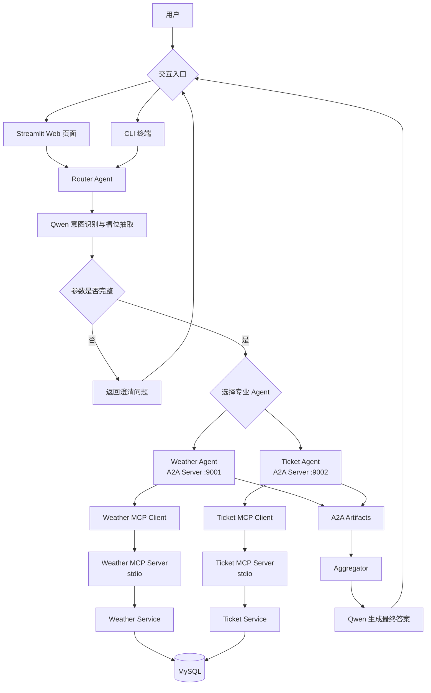

# A2A Travel Planner

基于 **A2A（Agent-to-Agent）**、**MCP（Model Context Protocol）**、本地大语言模型和 MySQL 实现的多智能体旅行规划系统。

用户可以使用自然语言同时查询天气与火车票。Router Agent 首先调用本地 Qwen 模型识别用户意图、抽取槽位并判断需要哪些专业 Agent；随后通过 A2A 协议并发调用 Weather Agent 和 Ticket Agent。专业 Agent 再通过 MCP 工具访问 MySQL，最后由大语言模型聚合查询结果并生成自然语言旅行建议。

项目提供两种交互方式：

- Streamlit Web 页面：支持查询输入、对话记录、多轮追问和调试信息展示
- CLI 终端程序：支持连续查询、多轮参数补充和异常堆栈输出

## 项目功能

- 自然语言旅行需求分析
- 天气查询意图识别与参数抽取
- 火车票查询意图识别与参数抽取
- 缺失参数检测和追问
- Streamlit Web 交互界面
- CLI 终端交互模式
- 多轮补充信息与上下文合并
- 多 Agent 自动路由
- 天气与票务 Agent 并发调用
- A2A Task 和 Agent Card 通信
- MCP stdio 工具调用
- MySQL 天气与票务数据查询
- Agent Artifact 标准化结果封装
- 大语言模型结果聚合与旅行建议生成

## 技术栈

| 分类 | 技术 | 用途 |
| --- | --- | --- |
| 编程语言 | Python 3.10+ | 项目主要开发语言 |
| Web 界面 | Streamlit | 提供查询、追问、历史记录和调试信息页面 |
| Agent 通信 | `python-a2a` | Agent Card、A2A Server、A2A Client、Task 通信 |
| 工具协议 | MCP / FastMCP | 将天气和票务查询封装为标准工具 |
| 大语言模型 | Qwen3-8B-AWQ | 意图识别、槽位抽取和最终答案生成 |
| 模型服务 | vLLM | 提供 OpenAI API 兼容的本地模型接口 |
| 模型客户端 | OpenAI Python SDK | 调用 vLLM 的 Chat Completions API |
| 数据库 | MySQL | 存储天气和火车票数据 |
| 数据库驱动 | PyMySQL | Python 访问 MySQL |
| 并发模型 | `asyncio` | 并发调用多个 A2A Agent |
| 数据格式 | JSON | LLM 分析结果、MCP 返回值和 Artifact 数据格式 |

## 系统架构



## 分层设计

项目采用清晰的分层结构：

```text
用户交互层
（Streamlit / CLI）
    ↓
Router 路由与聚合层
    ↓ A2A
专业 Agent 层
    ↓ MCP
MCP 工具层
    ↓
Service 数据访问层
    ↓
MySQL 数据层
```

### Router 层

负责理解用户需求、抽取查询参数、选择 Agent、并发发送任务以及聚合多个 Agent 的结果。

### 交互层

`app.py` 提供 Streamlit Web 页面，`scripts/chat_cli.py` 提供终端交互。两种入口都能在参数缺失时保存原始需求，将用户补充内容合并后重新交给 Router 分析。

### A2A Agent 层

Weather Agent 和 Ticket Agent 都是独立运行的 A2A Server。每个 Agent 使用 Agent Card 描述自身能力，通过 A2A Task 接收 Router 传入的槽位参数。

### MCP 层

专业 Agent 不直接访问数据库，而是通过 MCP Client 启动对应的 MCP Server，并调用标准 MCP Tool。MCP Server 负责参数接收、业务调用和结果序列化。

### Service 层

封装具体 SQL 查询，使 MCP 层与数据库实现解耦。

### 数据层

MySQL 保存天气和火车票数据。

## 完整项目流程

假设用户输入：

```text
我想在 2026-06-20 从富山去东京，帮我看看天气和新干线车票。
```

系统执行流程如下：

1. `router_agent.analyzer` 将用户问题发送给本地 Qwen 模型。
2. 模型返回结构化 JSON，包括意图、需要调用的 Agent、已抽取槽位和缺失槽位。
3. 如果参数缺失，Router 返回 `clarification_question`，不调用下游 Agent。
4. Streamlit 或 CLI 保存原始请求，收集用户补充信息，并组合成新的完整上下文。
5. Router 重新分析组合后的请求，直到参数完整。
6. Router 根据 `required_agents` 创建 A2A Task。
7. Weather Agent 和 Ticket Agent 使用 `asyncio.gather()` 并发执行。
8. Weather Agent 从 Task 中读取 `city` 和 `fx_date`。
9. Ticket Agent 从 Task 中读取 `departure_city`、`arrival_city` 和 `travel_date`。
10. 每个 Agent 的 MCP Client 通过 stdio 自动启动对应 MCP Server。
11. MCP Server 调用 Service 层执行参数化 SQL。
12. MySQL 返回天气或票务数据。
13. MCP Server 将日期、时间和 Decimal 等类型转换为 JSON 可序列化数据。
14. Agent Handler 将查询结果封装为 A2A Artifact，并附加到 Task。
15. Router 收集所有 Agent 返回的 Artifact。
16. `router_agent.aggregator` 将原始请求、意图分析和 Artifact 一起发送给 Qwen。
17. Qwen 生成面向用户的天气说明、车次信息和综合出行建议。
18. Web 页面展示回答、调用的 Agent、分析结果和完整 Artifact；CLI 输出最终回答。

## A2A 与 MCP 的职责

| 协议 | 通信范围 | 本项目中的作用 |
| --- | --- | --- |
| A2A | Router 与专业 Agent 之间 | Agent 能力发现、Task 分发和 Artifact 返回 |
| MCP | 专业 Agent 与工具之间 | 标准化天气和票务工具调用 |

简单来说：

```text
A2A 负责“Agent 找 Agent”
MCP 负责“Agent 调工具”
```

## 数据流

### Weather Agent

```text
Router
→ A2AClient
→ WeatherAgentServer
→ handle_weather_task
→ Weather MCP Client
→ query_weather MCP Tool
→ Weather Service
→ weather_data 表
→ weather_result Artifact
```

### Ticket Agent

```text
Router
→ A2AClient
→ TicketAgentServer
→ handle_ticket_task
→ Ticket MCP Client
→ query_train_tickets MCP Tool
→ Ticket Service
→ train_tickets 表
→ ticket_result Artifact
```

## 项目目录

```text
A2A-travel-planner/
├── app.py                   # Streamlit Web 应用入口
├── start-all.bat            # Windows 一键启动入口
├── stop-all.bat             # Windows 一键停止入口
├── a2a_agents/              # 天气和票务 A2A Agent
│   ├── weather_agent/
│   └── ticket_agent/
├── common/                  # 数据库、LLM、JSON、Artifact 公共模块
├── config/                  # MySQL 与 vLLM 配置
├── database/                # 数据库建表及测试数据
├── mcp_clients/             # MCP stdio 客户端
├── mcp_servers/             # FastMCP 工具服务
├── router_agent/            # 意图分析、Agent 路由与结果聚合
├── scripts/                 # 启停脚本、CSV 导入、CLI 和分层测试
├── services/                # MySQL 数据查询服务
├── requirements.txt         # 项目完整 Python 依赖
└── README.md
```

## Python 文件说明

### 根目录

| 文件 | 作用 |
| --- | --- |
| `app.py` | Streamlit Web 应用入口；负责查询输入、Session State、多轮追问、历史记录和 Router 调试信息展示。 |
| `start-all.bat` | Windows 一键启动入口；调用 PowerShell 脚本启动 Docker 容器、Agent 和 Streamlit。 |
| `stop-all.bat` | Windows 一键停止入口；停止本项目进程以及 MySQL、vLLM 容器。 |

### `config/`

| 文件 | 作用 |
| --- | --- |
| `config/__init__.py` | 将 `config` 标记为 Python 包。 |
| `config/settings.py` | 配置 MySQL 地址、端口、用户名、密码、数据库名，以及 vLLM 地址、API Key 和 Qwen 模型名。 |

### `common/`

| 文件 | 作用 |
| --- | --- |
| `common/db.py` | 创建 PyMySQL 连接，提供查询单条记录的 `query_one()` 和查询多条记录的 `query_all()`。 |
| `common/llm_client.py` | 创建 OpenAI SDK 客户端，通过 OpenAI 兼容接口调用本地 vLLM/Qwen 模型。 |
| `common/json_utils.py` | 从 LLM 输出中提取 JSON，兼容纯 JSON、Markdown 代码块以及夹杂说明文字的响应。 |
| `common/artifact_utils.py` | 统一创建包含类型、Agent、状态、数据、摘要和时间戳的 A2A Artifact。 |

### `services/`

| 文件 | 作用 |
| --- | --- |
| `services/__init__.py` | 将 `services` 标记为 Python 包。 |
| `services/weather_service.py` | 根据城市和日期查询 `weather_data` 表中的天气数据。 |
| `services/ticket_service.py` | 根据出发城市、到达城市和日期查询 `train_tickets` 表，并按出发时间排序。 |

### `mcp_servers/`

| 文件 | 作用 |
| --- | --- |
| `mcp_servers/__init__.py` | 将 `mcp_servers` 标记为 Python 包。 |
| `mcp_servers/weather_server.py` | 创建 Weather FastMCP Server，注册 `query_weather` 工具，调用天气 Service，并序列化日期字段。 |
| `mcp_servers/ticket_server.py` | 创建 Ticket FastMCP Server，注册 `query_train_tickets` 工具，调用票务 Service，并序列化日期与 Decimal 字段。 |

### `mcp_clients/`

| 文件 | 作用 |
| --- | --- |
| `mcp_clients/weather_client.py` | 通过 stdio 启动 Weather MCP Server、初始化 MCP Session，并调用 `query_weather` 工具。 |
| `mcp_clients/ticket_client.py` | 通过 stdio 启动 Ticket MCP Server、初始化 MCP Session，并调用 `query_train_tickets` 工具。 |

### `a2a_agents/weather_agent/`

| 文件 | 作用 |
| --- | --- |
| `a2a_agents/__init__.py` | 将 `a2a_agents` 标记为 Python 包。 |
| `a2a_agents/weather_agent/__init__.py` | 将 Weather Agent 目录标记为 Python 包。 |
| `a2a_agents/weather_agent/card.py` | 定义 Weather Agent 的主机、端口、URL、Agent Card 和 `query_weather` Skill。 |
| `a2a_agents/weather_agent/server.py` | 实现运行在 `127.0.0.1:9001` 的 Weather A2A Server，接收并处理 A2A Task。 |
| `a2a_agents/weather_agent/handler.py` | 校验天气槽位、调用 Weather MCP Client、生成天气摘要，并返回 `weather_result` Artifact。 |

### `a2a_agents/ticket_agent/`

| 文件 | 作用 |
| --- | --- |
| `a2a_agents/ticket_agent/__init__.py` | 将 Ticket Agent 目录标记为 Python 包。 |
| `a2a_agents/ticket_agent/card.py` | 定义 Ticket Agent 的主机、端口、URL、Agent Card 和 `query_train_tickets` Skill。 |
| `a2a_agents/ticket_agent/server.py` | 实现运行在 `127.0.0.1:9002` 的 Ticket A2A Server，接收并处理 A2A Task。 |
| `a2a_agents/ticket_agent/handler.py` | 校验票务槽位、调用 Ticket MCP Client、生成票务摘要，并返回 `ticket_result` Artifact。 |

### `router_agent/`

| 文件 | 作用 |
| --- | --- |
| `router_agent/__init__.py` | 将 `router_agent` 标记为 Python 包。 |
| `router_agent/analyzer.py` | 构造意图识别 Prompt，调用 Qwen，将自然语言请求转换为结构化路由 JSON。 |
| `router_agent/router.py` | 核心编排模块；创建 A2A Client、并发调用专业 Agent、合并 Artifact，并调用聚合器。 |
| `router_agent/aggregator.py` | 将用户问题、意图分析和多个 Artifact 交给 Qwen，生成最终自然语言答案。 |

### `scripts/` 业务测试

| 文件 | 作用 |
| --- | --- |
| `scripts/chat_cli.py` | CLI 交互入口；支持连续查询、缺失参数追问、上下文合并和退出命令。 |
| `scripts/import_csv_data.py` | 将天气和火车票 CSV 数据批量写入 MySQL，并通过唯一键执行更新或插入。 |
| `scripts/start_all.ps1` | 完整启动编排脚本；检查 Docker Desktop、等待容器就绪、管理虚拟环境并启动三个本地服务。 |
| `scripts/stop_all.ps1` | 根据 `.runtime` 中保存的 PID 停止本地服务，并可选择停止 Docker 容器。 |
| `scripts/test_mysql_connection.py` | 通过天气和票务 Service 验证 MySQL 连接与测试数据。 |
| `scripts/test_services.py` | 直接测试天气与票务 Service 层。 |
| `scripts/test_weather_mcp_logic.py` | 不经过 MCP 通信，直接测试天气 MCP 工具逻辑及未查询到数据的分支。 |
| `scripts/test_ticket_mcp_logic.py` | 不经过 MCP 通信，直接测试票务 MCP 工具逻辑及未查询到数据的分支。 |
| `scripts/test_weather_mcp_client.py` | 测试 Weather MCP Client 到 MCP Server 的完整 stdio 调用。 |
| `scripts/test_ticket_mcp_client.py` | 测试 Ticket MCP Client 到 MCP Server 的完整 stdio 调用。 |
| `scripts/test_weather_agent_handler.py` | 构造 A2A Task，直接测试 Weather Agent Handler。 |
| `scripts/test_ticket_agent_handler.py` | 构造 A2A Task，直接测试 Ticket Agent Handler。 |
| `scripts/test_weather_a2a_client.py` | 获取 Weather Agent Card，并向 9001 端口发送真实 A2A Task。 |
| `scripts/test_ticket_a2a_client.py` | 获取 Ticket Agent Card，并向 9002 端口发送真实 A2A Task。 |
| `scripts/test_router_analyzer.py` | 单独测试 Qwen 的意图识别和槽位抽取结果。 |
| `scripts/test_router_llm.py` | 完整端到端入口，执行意图分析、A2A 路由、MCP 查询和最终答案生成。 |

## 数据库设计

`database/init.sql` 创建以下数据表：

| 数据表 | 用途 | 当前接入 Agent |
| --- | --- | --- |
| `weather_data` | 天气预报数据 | Weather Agent |
| `train_tickets` | 火车票与余票数据 | Ticket Agent |

## 环境要求

- Python 3.10 或更高版本
- MySQL 8.0 或兼容版本
- 支持 OpenAI API 的 vLLM 服务
- 已下载或可访问 `Qwen/Qwen3-8B-AWQ`

## 安装依赖

在项目根目录创建虚拟环境：

```powershell
python -m venv .venv
.\.venv\Scripts\Activate.ps1
python -m pip install --upgrade pip
```

安装项目全部依赖：

```powershell
pip install -r requirements.txt
```

## 配置 MySQL

数据库连接信息通过环境变量配置。PowerShell 示例：

```powershell
$env:MYSQL_HOST = "127.0.0.1"
$env:MYSQL_PORT = "3306"
$env:MYSQL_USER = "root"
$env:MYSQL_PASSWORD = "your-password"
$env:MYSQL_DATABASE = "travel_planner"
```

除密码外，其余配置均提供本地开发默认值。`start-all.bat` 在没有设置
`MYSQL_PASSWORD` 时会安全提示输入，不会把密码保存到仓库。

导入数据库：

```powershell
cmd /c "mysql -u root -p < database\init.sql"
```

`database/init.sql` 默认创建 `travel_planner`，与项目默认配置保持一致。

验证数据库：

```powershell
python scripts/test_services.py
```

### 导入 CSV 数据

`data/` 目录中的天气和火车票 CSV 可以通过以下命令批量导入：

```powershell
python scripts/import_csv_data.py
```

导入脚本会：

- 自动识别 `weather_data_*.csv` 和 `train_tickets_*.csv`
- 使用 UTF-8 读取中文数据
- 自动创建缺失的数据表
- 忽略 CSV 中的自增 `id`
- 根据数据库唯一键执行插入或更新，可安全重复运行
- 使用同一事务导入全部文件，失败时自动回滚

如需指定其他 CSV 目录：

```powershell
python scripts/import_csv_data.py --data-dir D:\path\to\data
```

## 配置本地模型

vLLM 默认配置如下，也可以通过同名环境变量覆盖：

```powershell
$env:VLLM_BASE_URL = "http://127.0.0.1:8002/v1"
$env:VLLM_API_KEY = "EMPTY"
$env:VLLM_MODEL = "Qwen/Qwen3-8B-AWQ"
```

vLLM 必须在运行 Router 之前启动，并暴露 OpenAI 兼容接口。

示例：

```powershell
vllm serve Qwen/Qwen3-8B-AWQ --port 8002
```

## 启动项目

运行前请确保 MySQL 和 vLLM 已启动。项目侧需要分别启动两个 A2A Agent，再选择 Web 或 CLI 入口。

### Windows 一键启动

项目已按以下 Docker Desktop 容器配置完成：

| 服务 | 容器名称 | 宿主机端口 |
| --- | --- | --- |
| MySQL | `travel-planner-database` | `3306` |
| vLLM | `vllm-qwen3-8b-awq` | `8002` |

直接双击项目根目录的：

```text
start-all.bat
```

也可以在 PowerShell 中运行：

```powershell
.\scripts\start_all.ps1
```

脚本会自动执行：

1. 检查 Docker Desktop，未启动时尝试启动。
2. 启动 `travel-planner-database` 和 `vllm` 容器。
3. 等待 MySQL 响应 `mysqladmin ping`。
4. 等待 vLLM 的 `/v1/models` 接口可用。
5. 首次运行时创建 `.venv` 并安装 `requirements.txt`。
6. 后台启动 Weather Agent、Ticket Agent 和 Streamlit。
7. 等待 9001、9002、8501 端口就绪。
8. 自动打开 `http://127.0.0.1:8501`。

启动脚本会为所有 Python 服务及其 MCP 子进程强制启用 UTF-8：

```text
PYTHONUTF8=1
PYTHONIOENCODING=utf-8
python -X utf8
```

这样可以避免 Windows 默认控制台编码导致中文任务日志触发
`UnicodeEncodeError`，进而被 A2A Server 返回为 HTTP 500。

运行日志和 PID 文件保存在：

```text
.runtime/
```

如果已经手动安装依赖，可以跳过安装检查：

```powershell
.\scripts\start_all.ps1 -SkipInstall
```

如果不希望自动打开浏览器：

```powershell
.\scripts\start_all.ps1 -NoBrowser
```

如果 Docker Desktop 中的容器名称不同，可以通过参数覆盖：

```powershell
.\scripts\start_all.ps1 `
  -MySqlContainer "your-mysql-container" `
  -VllmContainer "your-vllm-container"
```

一键停止全部服务和两个 Docker 容器：

```text
stop-all.bat
```

只停止 Agent 和 Streamlit、保留容器运行：

```powershell
.\scripts\stop_all.ps1
```

### 手动启动

以下步骤适合调试单个服务。

### 1. 启动 Weather Agent

```powershell
python -m a2a_agents.weather_agent.server
```

服务地址：

```text
http://127.0.0.1:9001
```

### 2. 启动 Ticket Agent

```powershell
python -m a2a_agents.ticket_agent.server
```

服务地址：

```text
http://127.0.0.1:9002
```

### 3. 启动 Streamlit Web 页面

```powershell
streamlit run app.py
```

浏览器默认访问：

```text
http://localhost:8501
```

Web 页面提供：

- 自然语言查询输入
- 缺失参数追问
- 对话历史记录
- Router 分析结果
- 已调用 Agent 列表
- A2A Artifact 和完整 JSON 调试信息

### 4. 使用 CLI 终端

不使用 Web 页面时，可以运行：

```powershell
python scripts/chat_cli.py
```

支持以下退出命令：

```text
exit / quit / q / 退出
```

### 5. 运行固定示例

用于开发和端到端验证：

```powershell
python scripts/test_router_llm.py
```

Router 会依次完成：

```text
自然语言分析
→ Agent 选择
→ A2A 并发调用
→ MCP 工具调用
→ MySQL 查询
→ Artifact 聚合
→ 最终答案生成
```

## 分层测试

### Service 层

```powershell
python scripts/test_services.py
```

### MCP 工具逻辑

```powershell
python scripts/test_weather_mcp_logic.py
python scripts/test_ticket_mcp_logic.py
```

### MCP stdio 调用

```powershell
python scripts/test_weather_mcp_client.py
python scripts/test_ticket_mcp_client.py
```

### Agent Handler

```powershell
python scripts/test_weather_agent_handler.py
python scripts/test_ticket_agent_handler.py
```

### A2A 通信

先启动两个 Agent Server，再运行：

```powershell
python scripts/test_weather_a2a_client.py
python scripts/test_ticket_a2a_client.py
```

### Router 意图分析

```powershell
python scripts/test_router_analyzer.py
```

### 端到端流程

```powershell
python scripts/test_router_llm.py
```

### 交互入口

```powershell
python scripts/chat_cli.py
streamlit run app.py
```

## Router 分析结果格式

Qwen 会返回类似以下 JSON：

```json
{
  "intent": "travel_planning",
  "required_agents": [
    "weather_agent",
    "ticket_agent"
  ],
  "slots": {
    "departure_city": "富山",
    "arrival_city": "东京",
    "city": "东京",
    "fx_date": "2026-06-20",
    "travel_date": "2026-06-20"
  },
  "missing_slots": [],
  "need_clarification": false,
  "clarification_question": ""
}
```

## Artifact 格式

专业 Agent 使用统一结构返回结果：

```json
{
  "artifact_type": "weather_result",
  "agent": "weather_agent",
  "status": "success",
  "data": {},
  "summary": "天气查询摘要",
  "metadata": {
    "created_at": "2026-06-11T12:00:00"
  }
}
```

`status` 可能为：

- `success`：查询成功
- `not_found`：未查询到符合条件的数据
- `failed`：参数缺失或任务处理失败

## 端口说明

| 服务 | 地址 |
| --- | --- |
| vLLM OpenAI API | `http://127.0.0.1:8002/v1` |
| Weather A2A Agent | `http://127.0.0.1:9001` |
| Ticket A2A Agent | `http://127.0.0.1:9002` |
| Streamlit Web 页面 | `http://localhost:8501` |
| Weather MCP Server | stdio，由 MCP Client 自动启动 |
| Ticket MCP Server | stdio，由 MCP Client 自动启动 |

## 项目特点

- 使用 A2A 将专业 Agent 解耦为独立服务
- 使用 MCP 将 Agent 与具体工具实现解耦
- 使用 Agent Card 描述 Agent 能力
- 使用 Task Metadata 传递结构化槽位
- 使用 Artifact 统一不同 Agent 的返回格式
- 使用 `asyncio.gather()` 并发执行多个查询
- 同时提供 Streamlit 与 CLI 两种用户入口
- 支持参数缺失后的多轮追问和上下文合并
- 使用本地 Qwen 完成理解与生成，数据查询结果仍来自 MySQL
- Service、MCP、Agent、Router 各层都可独立测试

## Router 自动评测

项目提供带标准答案的 Router 测试集，覆盖天气、铁路票务、组合查询、
缺失参数、未支持请求和易误路由表达。

运行完整评测：

```powershell
python -X utf8 -m scripts.evaluate_router
```

评测会输出：

- 意图识别准确率
- Agent 路由完全匹配准确率
- Agent Precision、Recall、F1
- Agent 误调用率与未支持请求误调用率
- 槽位值准确率与缺失槽位准确率
- 槽位 Precision、Recall、F1、严格完全匹配率和多余槽位率
- 追问判断准确率
- 整体用例通过率
- Mean、P50、P95 推理延迟

详细指标定义和数据集说明见 `evaluation/README.md`。完整 JSON 报告默认保存在
`.runtime/evaluation/`，当前三轮基准结果见 `evaluation/BASELINE.md`。

## 注意事项

- 部分源文件中的中文文本存在编码显示异常时，请确认编辑器和终端统一使用 UTF-8。
- 当前 Router 只实现 Weather Agent 和 Ticket Agent 的实际调用。

## License

本项目暂未声明开源许可证。
