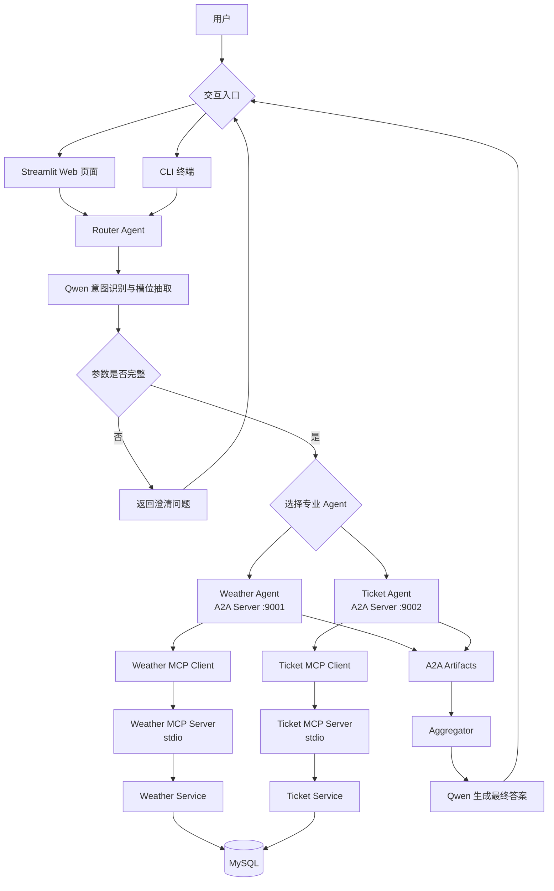

# A2A Travel Planner

基于 **A2A（Agent-to-Agent）**、**MCP（Model Context Protocol）**、本地大语言模型和 MySQL 实现的多智能体旅行规划系统。

用户可以使用自然语言同时查询天气与火车票。Router Agent 首先调用本地 Qwen 模型识别用户意图、抽取槽位并判断需要哪些专业 Agent；随后通过 A2A 协议并发调用 Weather Agent 和 Ticket Agent。专业 Agent 再通过 MCP 工具访问 MySQL，最后由大语言模型聚合查询结果并生成自然语言旅行建议。

项目提供两种交互方式：

- Streamlit Web 页面：支持查询输入、对话记录、多轮追问和调试信息展示
- CLI 终端程序：支持连续查询、多轮参数补充和异常堆栈输出

## 项目功能

- 自然语言旅行需求分析
- 天气查询意图识别与参数抽取
- 火车票查询意图识别与参数抽取
- 缺失参数检测和追问
- Streamlit Web 交互界面
- CLI 终端交互模式
- 多轮补充信息与上下文合并
- 多 Agent 自动路由
- 天气与票务 Agent 并发调用
- A2A Task 和 Agent Card 通信
- MCP stdio 工具调用
- MySQL 天气与票务数据查询
- Agent Artifact 标准化结果封装
- 大语言模型结果聚合与旅行建议生成
- 跨 Router、LLM、A2A Client 与 Agent Server 的 trace_id 追踪与结构化 JSON 日志
- LLM 与 A2A 调用的超时、重试与失败退避
- 单个 Agent 失败时的优雅降级（部分成功）
- MySQL 连接池复用，降低建连开销
- Router 意图识别离线评测框架（准确率与延迟指标）

## 技术栈

| 分类 | 技术 | 用途 |
| --- | --- | --- |
| 编程语言 | Python 3.10+ | 项目主要开发语言 |
| Web 界面 | Streamlit | 提供查询、追问、历史记录和调试信息页面 |
| Agent 通信 | `python-a2a` | Agent Card、A2A Server、A2A Client、Task 通信 |
| 工具协议 | MCP / FastMCP | 将天气和票务查询封装为标准工具 |
| 大语言模型 | Qwen3-8B-AWQ | 意图识别、槽位抽取和最终答案生成 |
| 模型服务 | vLLM | 提供 OpenAI API 兼容的本地模型接口 |
| 模型客户端 | OpenAI Python SDK | 调用 vLLM 的 Chat Completions API |
| 实时数据 | Open-Meteo API | 免费免 key 的实时天气预报，覆盖未来预报窗口，数据库作为兜底 |
| 数据库 | MySQL | 存储天气和火车票数据 |
| 数据库驱动 | PyMySQL | Python 访问 MySQL |
| 连接池 | DBUtils（PooledDB） | 复用 MySQL 连接，避免每次查询重新建连 |
| 并发模型 | `asyncio` | 并发调用多个 A2A Agent |
| 线程并发 | `concurrent.futures` | 评测时用线程池并发跑用例，利用 vLLM 批处理 |
| 日志与追踪 | `logging`（JSON 格式）+ trace_id | 结构化日志，跨层串联同一次请求 |
| 数据格式 | JSON | LLM 分析结果、MCP 返回值和 Artifact 数据格式 |

## 系统架构



## 分层设计

项目采用清晰的分层结构：

```text
用户交互层
（Streamlit / CLI）
    ↓
Router 路由与聚合层
    ↓ A2A
专业 Agent 层
    ↓ MCP
MCP 工具层
    ↓
Service 数据访问层
    ↓
MySQL 数据层
```

### Router 层

负责理解用户需求、抽取查询参数、选择 Agent、并发发送任务以及聚合多个 Agent 的结果。

### 交互层

`app.py` 提供 Streamlit Web 页面，`scripts/chat_cli.py` 提供终端交互。两种入口都能在参数缺失时保存原始需求，将用户补充内容合并后重新交给 Router 分析。

### A2A Agent 层

Weather Agent 和 Ticket Agent 都是独立运行的 A2A Server。每个 Agent 使用 Agent Card 描述自身能力，通过 A2A Task 接收 Router 传入的槽位参数。

### MCP 层

专业 Agent 不直接访问数据库，而是通过 MCP Client 启动对应的 MCP Server，并调用标准 MCP Tool。MCP Server 负责参数接收、业务调用和结果序列化。

### Service 层

封装具体 SQL 查询，使 MCP 层与数据库实现解耦。

### 数据层

MySQL 保存天气和火车票数据。

## 完整项目流程

假设用户输入：

```text
我想在 2026-06-20 从富山去东京，帮我看看天气和新干线车票。
```

系统执行流程如下：

1. `router_agent.analyzer` 将用户问题发送给本地 Qwen 模型。
2. 模型返回结构化 JSON，包括意图、需要调用的 Agent、已抽取槽位和缺失槽位。
3. 如果参数缺失，Router 返回 `clarification_question`，不调用下游 Agent。
4. Streamlit 或 CLI 保存原始请求，收集用户补充信息，并组合成新的完整上下文。
5. Router 重新分析组合后的请求，直到参数完整。
6. Router 根据 `required_agents` 创建 A2A Task。
7. Weather Agent 和 Ticket Agent 使用 `asyncio.gather()` 并发执行。
8. Weather Agent 从 Task 中读取 `city` 和 `fx_date`。
9. Ticket Agent 从 Task 中读取 `departure_city`、`arrival_city` 和 `travel_date`。
10. 每个 Agent 的 MCP Client 通过 stdio 自动启动对应 MCP Server。
11. MCP Server 调用 Service 层执行参数化 SQL。
12. MySQL 返回天气或票务数据。
13. MCP Server 将日期、时间和 Decimal 等类型转换为 JSON 可序列化数据。
14. Agent Handler 将查询结果封装为 A2A Artifact，并附加到 Task。
15. Router 收集所有 Agent 返回的 Artifact。
16. `router_agent.aggregator` 将原始请求、意图分析和 Artifact 一起发送给 Qwen。
17. Qwen 生成面向用户的天气说明、车次信息和综合出行建议。
18. Web 页面展示回答、调用的 Agent、分析结果和完整 Artifact；CLI 输出最终回答。

## A2A 与 MCP 的职责

| 协议 | 通信范围 | 本项目中的作用 |
| --- | --- | --- |
| A2A | Router 与专业 Agent 之间 | Agent 能力发现、Task 分发和 Artifact 返回 |
| MCP | 专业 Agent 与工具之间 | 标准化天气和票务工具调用 |

简单来说：

```text
A2A 负责“Agent 找 Agent”
MCP 负责“Agent 调工具”
```

## 可观测性与容错

为了让系统更接近可运维的状态，项目在基础流程之上增加了以下能力：

- **结构化日志**：`common/logger.py` 统一输出 JSON 格式日志，便于检索和分析。
- **trace_id 追踪**：每次请求在 Router 入口生成 `trace_id`，贯穿意图分析、LLM 调用、A2A 调用以及 Agent Server 处理，可在日志中串联同一次请求。当前覆盖 Router / LLM / A2A Client / Agent Server，尚未透传到 MCP 子进程内部。
- **超时与重试**：LLM、A2A 与 MCP 调用都设置了超时时间，LLM 和 A2A 还带失败重试（退避），避免单点卡死拖垮整条链路。
- **优雅降级**：使用 `asyncio.gather(return_exceptions=True)` 并发调用 Agent，单个 Agent 失败时仍返回其他 Agent 的结果，整体状态标记为 `partial_success`；全部失败则返回 `agent_failed` 且不再调用最终回答 LLM。
- **阶段计时**：`common/timer.py` 记录意图分析、A2A 调用和最终答案生成各阶段耗时。

> 说明：连接池、超时重试、结构化日志等属于工程化加固。仍可进一步完善的方向包括：trace_id 透传到 MCP 子进程、A2A Server 鉴权与限流、自动化测试与 CI、以及将 MCP 由每次 stdio 启动改为常驻服务。

## 数据流

### Weather Agent

```text
Router
→ A2AClient
→ WeatherAgentServer
→ handle_weather_task
→ Weather MCP Client
→ query_weather MCP Tool
→ Weather Service
→ weather_data 表
→ weather_result Artifact
```

### Ticket Agent

```text
Router
→ A2AClient
→ TicketAgentServer
→ handle_ticket_task
→ Ticket MCP Client
→ query_train_tickets MCP Tool
→ Ticket Service
→ train_tickets 表
→ ticket_result Artifact
```

## 项目目录

```text
A2A-travel-planner/
├── app.py                   # Streamlit Web 应用入口
├── start-all.bat            # Windows 一键启动入口
├── stop-all.bat             # Windows 一键停止入口
├── a2a_agents/              # 天气和票务 A2A Agent
│   ├── weather_agent/
│   └── ticket_agent/
├── common/                  # 数据库连接池、LLM、JSON、Artifact、日志、计时公共模块
├── config/                  # MySQL、vLLM 与超时/重试配置
├── database/                # 数据库建表及测试数据
├── evaluation/              # Router 意图识别评测用例与结果
├── mcp_clients/             # MCP stdio 客户端
├── mcp_servers/             # FastMCP 工具服务
├── router_agent/            # 意图分析、Agent 路由与结果聚合
├── scripts/                 # 启停脚本、CSV 导入、CLI、分层测试与评测
├── services/                # MySQL 数据查询服务
├── requirements.txt         # 项目完整 Python 依赖
└── README.md
```

## Python 文件说明

### 根目录

| 文件 | 作用 |
| --- | --- |
| `app.py` | Streamlit Web 应用入口；负责查询输入、Session State、多轮追问、历史记录和 Router 调试信息展示。 |
| `start-all.bat` | Windows 一键启动入口；调用 PowerShell 脚本启动 Docker 容器、Agent 和 Streamlit。 |
| `stop-all.bat` | Windows 一键停止入口；停止本项目进程以及 MySQL、vLLM 容器。 |

### `config/`

| 文件 | 作用 |
| --- | --- |
| `config/__init__.py` | 将 `config` 标记为 Python 包。 |
| `config/settings.py` | 配置 MySQL 与 vLLM 连接信息，以及 LLM 和 A2A 的超时秒数与重试次数（`LLM_TIMEOUT_SECONDS`、`A2A_TIMEOUT_SECONDS` 等）。 |

### `common/`

| 文件 | 作用 |
| --- | --- |
| `common/db.py` | 基于 DBUtils 的 MySQL 连接池，提供 `query_one()` 和 `query_all()`；连接用完归还池中复用，懒加载不在 import 时强连数据库。 |
| `common/llm_client.py` | 创建 OpenAI SDK 客户端调用本地 vLLM/Qwen；内置超时、重试、思考内容剥离，并按 trace_id 记录调用日志。 |
| `common/json_utils.py` | 从 LLM 输出中提取 JSON，兼容纯 JSON、Markdown 代码块以及夹杂说明文字的响应。 |
| `common/artifact_utils.py` | 统一创建包含类型、Agent、状态、数据、摘要和时间戳的 A2A Artifact。 |
| `common/logger.py` | 配置全局结构化 JSON 日志，提供 `get_logger()`、`log_event()` 和 `new_trace_id()`。 |
| `common/timer.py` | 上下文管理器 `timer()`，统计各阶段耗时并按 trace_id 写入结构化日志。 |

### `services/`

| 文件 | 作用 |
| --- | --- |
| `services/__init__.py` | 将 `services` 标记为 Python 包。 |
| `services/weather_service.py` | 根据城市和日期查询 `weather_data` 表中的天气数据。 |
| `services/ticket_service.py` | 根据出发城市、到达城市和日期查询 `train_tickets` 表，并按出发时间排序。 |

### `mcp_servers/`

| 文件 | 作用 |
| --- | --- |
| `mcp_servers/__init__.py` | 将 `mcp_servers` 标记为 Python 包。 |
| `mcp_servers/weather_server.py` | 创建 Weather FastMCP Server，注册 `query_weather` 工具，调用天气 Service，并序列化日期字段。 |
| `mcp_servers/ticket_server.py` | 创建 Ticket FastMCP Server，注册 `query_train_tickets` 工具，调用票务 Service，并序列化日期与 Decimal 字段。 |

### `mcp_clients/`

| 文件 | 作用 |
| --- | --- |
| `mcp_clients/weather_client.py` | 通过 stdio 启动 Weather MCP Server、初始化 MCP Session，并调用 `query_weather` 工具。 |
| `mcp_clients/ticket_client.py` | 通过 stdio 启动 Ticket MCP Server、初始化 MCP Session，并调用 `query_train_tickets` 工具。 |

### `a2a_agents/weather_agent/`

| 文件 | 作用 |
| --- | --- |
| `a2a_agents/__init__.py` | 将 `a2a_agents` 标记为 Python 包。 |
| `a2a_agents/weather_agent/__init__.py` | 将 Weather Agent 目录标记为 Python 包。 |
| `a2a_agents/weather_agent/card.py` | 定义 Weather Agent 的主机、端口、URL、Agent Card 和 `query_weather` Skill。 |
| `a2a_agents/weather_agent/server.py` | 实现运行在 `127.0.0.1:9001` 的 Weather A2A Server，接收并处理 A2A Task。 |
| `a2a_agents/weather_agent/handler.py` | 校验天气槽位、调用 Weather MCP Client、生成天气摘要，并返回 `weather_result` Artifact。 |

### `a2a_agents/ticket_agent/`

| 文件 | 作用 |
| --- | --- |
| `a2a_agents/ticket_agent/__init__.py` | 将 Ticket Agent 目录标记为 Python 包。 |
| `a2a_agents/ticket_agent/card.py` | 定义 Ticket Agent 的主机、端口、URL、Agent Card 和 `query_train_tickets` Skill。 |
| `a2a_agents/ticket_agent/server.py` | 实现运行在 `127.0.0.1:9002` 的 Ticket A2A Server，接收并处理 A2A Task。 |
| `a2a_agents/ticket_agent/handler.py` | 校验票务槽位、调用 Ticket MCP Client、生成票务摘要，并返回 `ticket_result` Artifact。 |

### `router_agent/`

| 文件 | 作用 |
| --- | --- |
| `router_agent/__init__.py` | 将 `router_agent` 标记为 Python 包。 |
| `router_agent/analyzer.py` | 构造意图识别 Prompt，调用 Qwen，并用关键词与否定表达规则纠偏，输出结构化路由 JSON。 |
| `router_agent/router.py` | 核心编排模块；生成 trace_id、带超时与重试地并发调用专业 Agent、合并 Artifact、对单 Agent 失败做降级，并调用聚合器。 |
| `router_agent/aggregator.py` | 将用户问题、意图分析和多个 Artifact 交给 Qwen，生成最终自然语言答案。 |

### `scripts/` 业务测试

| 文件 | 作用 |
| --- | --- |
| `scripts/chat_cli.py` | CLI 交互入口；支持连续查询、缺失参数追问、上下文合并和退出命令。 |
| `scripts/import_csv_data.py` | 将天气和火车票 CSV 数据批量写入 MySQL，并通过唯一键执行更新或插入。 |
| `scripts/start_all.ps1` | 完整启动编排脚本；检查 Docker Desktop、等待容器就绪、管理虚拟环境并启动三个本地服务。 |
| `scripts/stop_all.ps1` | 根据 `.runtime` 中保存的 PID 停止本地服务，并可选择停止 Docker 容器。 |
| `scripts/test_services.py` | 直接测试天气与票务 Service 层。 |
| `scripts/test_weather_a2a_client.py` | 获取 Weather Agent Card，并向 9001 端口发送真实 A2A Task。 |
| `scripts/test_ticket_a2a_client.py` | 获取 Ticket Agent Card，并向 9002 端口发送真实 A2A Task。 |
| `scripts/test_router_analyzer.py` | 单独测试 Qwen 的意图识别和槽位抽取结果。 |
| `scripts/test_router_llm.py` | 完整端到端入口，执行意图分析、A2A 路由、MCP 查询和最终答案生成。 |
| `scripts/generate_router_eval_cases.py` | 基于数据库数据生成 Router 意图识别评测用例。 |
| `scripts/evaluate_router.py` | 用线程池并发跑评测用例，统计意图、路由、槽位准确率与延迟，结果写入 `evaluation/`。 |

## 数据库设计

`database/init.sql` 创建以下数据表：

| 数据表 | 用途 | 当前接入 Agent |
| --- | --- | --- |
| `weather_data` | 天气预报数据 | Weather Agent |
| `train_tickets` | 火车票与余票数据 | Ticket Agent |

## 环境要求

- Python 3.10 或更高版本
- MySQL 8.0 或兼容版本
- 支持 OpenAI API 的 vLLM 服务
- 已下载或可访问 `Qwen/Qwen3-8B-AWQ`

## 安装依赖

在项目根目录创建虚拟环境：

```powershell
python -m venv .venv
.\.venv\Scripts\Activate.ps1
python -m pip install --upgrade pip
```

安装项目全部依赖：

```powershell
pip install -r requirements.txt
```

## 配置 MySQL

数据库连接信息通过环境变量配置。PowerShell 示例：

```powershell
$env:MYSQL_HOST = "127.0.0.1"
$env:MYSQL_PORT = "3306"
$env:MYSQL_USER = "root"
$env:MYSQL_PASSWORD = "your-password"
$env:MYSQL_DATABASE = "travel_planner"
```

除密码外，其余配置均提供本地开发默认值。`start-all.bat` 在没有设置
`MYSQL_PASSWORD` 时会安全提示输入，不会把密码保存到仓库。

导入数据库：

```powershell
cmd /c "mysql -u root -p < database\init.sql"
```

`database/init.sql` 默认创建 `travel_planner`，与项目默认配置保持一致。

验证数据库：

```powershell
python scripts/test_services.py
```

### 导入 CSV 数据

`data/` 目录中的天气和火车票 CSV 可以通过以下命令批量导入：

```powershell
python scripts/import_csv_data.py
```

导入脚本会：

- 自动识别 `weather_data_*.csv` 和 `train_tickets_*.csv`
- 使用 UTF-8 读取中文数据
- 自动创建缺失的数据表
- 忽略 CSV 中的自增 `id`
- 根据数据库唯一键执行插入或更新，可安全重复运行
- 使用同一事务导入全部文件，失败时自动回滚

如需指定其他 CSV 目录：

```powershell
python scripts/import_csv_data.py --data-dir D:\path\to\data
```

## 配置本地模型

vLLM 默认配置如下，也可以通过同名环境变量覆盖：

```powershell
$env:VLLM_BASE_URL = "http://127.0.0.1:8002/v1"
$env:VLLM_API_KEY = "EMPTY"
$env:VLLM_MODEL = "Qwen/Qwen3-8B-AWQ"
```

vLLM 必须在运行 Router 之前启动，并暴露 OpenAI 兼容接口。

### 超时、重试与连接池

以下配置均有默认值，可按需通过环境变量覆盖：

```powershell
# LLM、A2A 与 MCP 的超时秒数和重试次数
$env:LLM_TIMEOUT_SECONDS = "60"
$env:LLM_RETRY_TIMES = "1"
$env:A2A_TIMEOUT_SECONDS = "30"
$env:A2A_RETRY_TIMES = "1"
$env:MCP_TIMEOUT_SECONDS = "20"

# MySQL 连接池
$env:MYSQL_POOL_MAX = "10"        # 池中最大连接数
$env:MYSQL_POOL_MIN = "0"         # 启动预建连接数（0 = 懒加载，import 时不连库）
$env:MYSQL_POOL_MAX_IDLE = "5"    # 空闲时最多保留的连接数

# 实时天气 API（Open-Meteo，免费免 key）
$env:WEATHER_API_ENABLED = "1"          # 设为 0 则仅使用本地数据库
$env:WEATHER_API_TIMEOUT_SECONDS = "8"
```

> 天气查询优先使用实时 API（覆盖今天起约 16 天内的预报），超出窗口、查无城市或网络异常时自动回退到本地 `weather_data` 表。

示例：

```powershell
vllm serve Qwen/Qwen3-8B-AWQ --port 8002
```

## 启动项目

运行前请确保 MySQL 和 vLLM 已启动。项目侧需要分别启动两个 A2A Agent，再选择 Web 或 CLI 入口。

### Windows 一键启动

项目已按以下 Docker Desktop 容器配置完成：

| 服务 | 容器名称 | 宿主机端口 |
| --- | --- | --- |
| MySQL | `travel-planner-database` | `3306` |
| vLLM | `vllm-qwen3-8b-awq` | `8002` |

直接双击项目根目录的：

```text
start-all.bat
```

也可以在 PowerShell 中运行：

```powershell
.\scripts\start_all.ps1
```

脚本会自动执行：

1. 检查 Docker Desktop，未启动时尝试启动。
2. 启动 `travel-planner-database` 和 `vllm` 容器。
3. 等待 MySQL 响应 `mysqladmin ping`。
4. 等待 vLLM 的 `/v1/models` 接口可用。
5. 首次运行时创建 `.venv` 并安装 `requirements.txt`。
6. 后台启动 Weather Agent、Ticket Agent 和 Streamlit。
7. 等待 9001、9002、8501 端口就绪。
8. 自动打开 `http://127.0.0.1:8501`。

启动脚本会为所有 Python 服务及其 MCP 子进程强制启用 UTF-8：

```text
PYTHONUTF8=1
PYTHONIOENCODING=utf-8
python -X utf8
```

这样可以避免 Windows 默认控制台编码导致中文任务日志触发
`UnicodeEncodeError`，进而被 A2A Server 返回为 HTTP 500。

运行日志和 PID 文件保存在：

```text
.runtime/
```

如果已经手动安装依赖，可以跳过安装检查：

```powershell
.\scripts\start_all.ps1 -SkipInstall
```

如果不希望自动打开浏览器：

```powershell
.\scripts\start_all.ps1 -NoBrowser
```

如果 Docker Desktop 中的容器名称不同，可以通过参数覆盖：

```powershell
.\scripts\start_all.ps1 `
  -MySqlContainer "your-mysql-container" `
  -VllmContainer "your-vllm-container"
```

一键停止全部服务和两个 Docker 容器：

```text
stop-all.bat
```

只停止 Agent 和 Streamlit、保留容器运行：

```powershell
.\scripts\stop_all.ps1
```

### 手动启动

以下步骤适合调试单个服务。

### 1. 启动 Weather Agent

```powershell
python -m a2a_agents.weather_agent.server
```

服务地址：

```text
http://127.0.0.1:9001
```

### 2. 启动 Ticket Agent

```powershell
python -m a2a_agents.ticket_agent.server
```

服务地址：

```text
http://127.0.0.1:9002
```

### 3. 启动 Streamlit Web 页面

```powershell
streamlit run app.py
```

浏览器默认访问：

```text
http://localhost:8501
```

Web 页面提供：

- 自然语言查询输入
- 缺失参数追问
- 对话历史记录
- Router 分析结果
- 已调用 Agent 列表
- A2A Artifact 和完整 JSON 调试信息

### 4. 使用 CLI 终端

不使用 Web 页面时，可以运行：

```powershell
python scripts/chat_cli.py
```

支持以下退出命令：

```text
exit / quit / q / 退出
```

### 5. 运行固定示例

用于开发和端到端验证：

```powershell
python scripts/test_router_llm.py
```

Router 会依次完成：

```text
自然语言分析
→ Agent 选择
→ A2A 并发调用
→ MCP 工具调用
→ MySQL 查询
→ Artifact 聚合
→ 最终答案生成
```

## 分层测试

### Service 层

```powershell
python scripts/test_services.py
```

### A2A 通信

先启动两个 Agent Server，再运行：

```powershell
python scripts/test_weather_a2a_client.py
python scripts/test_ticket_a2a_client.py
```

### Router 意图分析

```powershell
python scripts/test_router_analyzer.py
```

### 端到端流程

```powershell
python scripts/test_router_llm.py
```

### 交互入口

```powershell
python scripts/chat_cli.py
streamlit run app.py
```

### Router 意图识别评测

对 `evaluation/router_eval_cases.json` 中的用例批量运行意图识别，统计准确率与延迟：

```powershell
python scripts/evaluate_router.py
```

评测使用线程池并发执行（默认 4 线程），可通过环境变量调整并发度：

```powershell
$env:ROUTER_EVAL_WORKERS = "4"
python scripts/evaluate_router.py
```

由于本地 vLLM 支持连续批处理（continuous batching），并发请求会被合并到 GPU 一起处理，
因此并发执行能显著缩短评测总耗时；加速比受 GPU 显存与算力上限约束，不会随线程数线性增长。
评测结果写入 `evaluation/router_eval_results.json`，汇总里的 `total_wall_seconds` 反映真实总耗时。

### 评测驱动的优化结果

以 100 条用例为基准，通过评测定位失败模式后，开启模型思考模式并在 `analyzer` 中加入关键词与否定表达纠偏规则，路由质量显著提升：

| 指标 | Baseline（无思考） | 优化后 | 变化 |
| --- | --- | --- | --- |
| 失败用例数 | 27 / 100 | 1 / 100 | ↓ 96% |
| 意图识别准确率 | 90% | 99% | +9 |
| Agent 路由准确率 | 90% | 99% | +9 |
| 槽位精确匹配 | 82% | 99% | +17 |
| 缺失槽位判断准确率 | 75% | 100% | +25 |
| 追问判断准确率 | 79% | 100% | +21 |
| 平均单用例延迟 | 1.4s | 5～7s | ↑（思考模式带来的代价） |

优化手段：开启思考模式、关键词/否定表达纠偏、补全火车票关键词、确定性槽位推导（缺 `city` 用 `arrival_city`、缺 `fx_date` 用 `travel_date`）。思考模式以延迟换取准确率，路由失败率从 27% 降至 1%；唯一残留失败是不含任何领域关键词的模糊请求，属语义上本就两可的边界情形。

## Router 分析结果格式

Qwen 会返回类似以下 JSON：

```json
{
  "intent": "travel_planning",
  "required_agents": [
    "weather_agent",
    "ticket_agent"
  ],
  "slots": {
    "departure_city": "富山",
    "arrival_city": "东京",
    "city": "东京",
    "fx_date": "2026-06-20",
    "travel_date": "2026-06-20"
  },
  "missing_slots": [],
  "need_clarification": false,
  "clarification_question": ""
}
```

## Artifact 格式

专业 Agent 使用统一结构返回结果：

```json
{
  "artifact_type": "weather_result",
  "agent": "weather_agent",
  "status": "success",
  "data": {},
  "summary": "天气查询摘要",
  "metadata": {
    "created_at": "2026-06-11T12:00:00"
  }
}
```

单个 Artifact 的 `status` 可能为：

- `success`：查询成功
- `not_found`：未查询到符合条件的数据
- `failed`：参数缺失或任务处理失败

Router 聚合后返回的整体 `status` 可能为：

- `success`：全部 Agent 成功
- `partial_success`：部分 Agent 失败，但仍有可用结果（优雅降级）
- `agent_failed`：所有被调用的 Agent 都失败
- `need_clarification`：参数缺失，需要追问
- `no_supported_agent`：没有匹配到支持的 Agent

整体响应中还包含 `trace_id`，可用于在结构化日志里串联同一次请求。

## 端口说明

| 服务 | 地址 |
| --- | --- |
| vLLM OpenAI API | `http://127.0.0.1:8002/v1` |
| Weather A2A Agent | `http://127.0.0.1:9001` |
| Ticket A2A Agent | `http://127.0.0.1:9002` |
| Streamlit Web 页面 | `http://localhost:8501` |
| Weather MCP Server | stdio，由 MCP Client 自动启动 |
| Ticket MCP Server | stdio，由 MCP Client 自动启动 |

## 项目特点

- 使用 A2A 将专业 Agent 解耦为独立服务
- 使用 MCP 将 Agent 与具体工具实现解耦
- 使用 Agent Card 描述 Agent 能力
- 使用 Task Metadata 传递结构化槽位
- 使用 Artifact 统一不同 Agent 的返回格式
- 使用 `asyncio.gather()` 并发执行多个查询
- 同时提供 Streamlit 与 CLI 两种用户入口
- 支持参数缺失后的多轮追问和上下文合并
- 使用本地 Qwen 完成理解与生成，数据查询结果仍来自 MySQL
- Service、MCP、Agent、Router 各层都可独立测试
- 通过 trace_id 与结构化 JSON 日志实现请求级可观测性
- LLM 与 A2A 调用具备超时、重试与失败退避
- 单 Agent 失败时优雅降级，返回部分可用结果
- MySQL 连接池复用连接，降低高并发下的建连开销
- 提供 Router 意图识别离线评测框架，量化准确率与延迟

## 注意事项

- 部分源文件中的中文文本存在编码显示异常时，请确认编辑器和终端统一使用 UTF-8。
- 当前 Router 只实现 Weather Agent 和 Ticket Agent 的实际调用。

## License

本项目暂未声明开源许可证。
